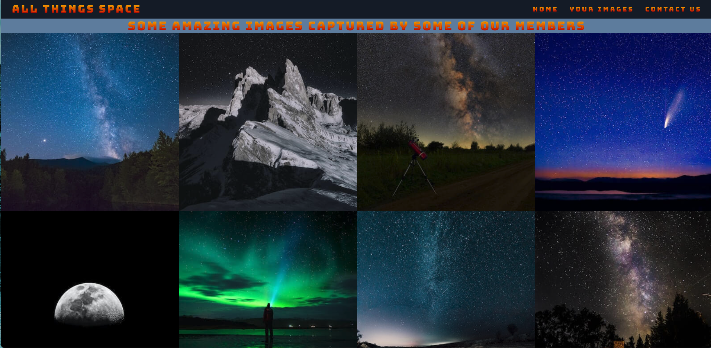
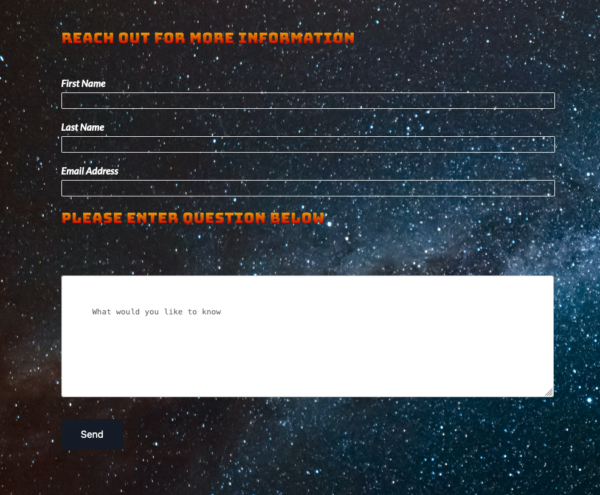

# All Things Space #

All things space is a website which its primary function is to help gain new members to club of space enthusiasts. All things space is a club of space enthusiasts located in the south west of Ireland who meet up on a regular space to share in each others love for space.

Users who visit this website will be able to understand what this club is about , meeting places and also reach out through a contact form and ask any questions they may have. There is also a page showing recent photos taaken by club memebers.

# Place Holder Image #

## Features ##

 * Navigation

    * On the top left hand side of the page is thr club name All Things Space. This links you back to the homepage.
    * The others navigational links at the top of the page , Home, Your Images & Contact Us all bring you to those namesake pages.
    * The navigational links use a Google font called Bungee Spice with an orange colour. This style of test has a retro spaacey feel about it which compliments the colour theme and gives the user a sense of what this site may be about.
    * The navigational links clearly tell the user where to go on the site and allows the user to navigate quiet easily around the site.

    

 * Header

    * Featured on the top of the page there is a hero .mp4 video of a the globe spinning. This gives the user a clear idea on what the main topic of the site and club is.
    * There is also some text on the bottom left of the video . This is to draw the users eyes down the page which encourages them to scroll down and interact with the site.

    

 * The about us section

    * This section gives some information on what the club is about , when meetings are and on what it is the club does.
    * There os also an image of a man using a telescope just to again emphasizewhat it is the club is about.     

    

 * Where we meet

    * This is a simple embedded Google Maps I-frame giving detailed information on where meetings are held 

    

 * Your Images

    * This is a page showcasing some of the better images taken by members of the space club.

       

 * Contact Us

    * This page allows users fill out a form which gathers their name and email address. It also asks them to send a question. 
    * The form will not send unless all blocks are fille out.
    * Once the form has been sent it directs the user to a thank you page which then re-directs the user back to the homepage. 

      

* Footer

    * All pages have a footer disaplying the various social media links. This helps drive engagement on our social platforms. 

    

# Testing #

   * This site works in different browsers, Chrome , Safari & Firefox
   * The site is responsive and reacts well to different screen sizes.
   * I confirmed that thr navigationl links work, are easy to understand and all content text is readable.
   * I confirmed the form does work, each box must be filled otherwise the form will not submit. Also the email field must show a valid email or the form will not send.

# Bugs #

*Solved Problems*

   * The background in the about us section caused the about us header to become unreadable. Creating a darker backgrouynd solved this
   * On a smaller screen a bit white space formed between the about us section and the main video banner. This was becasue I had a heigth deine for the video and removing this fixed it. 

# Validator Testing #

* HTML
   * No errors were retuned when passing through the official W3C validator
* CSS
   * No errors were retuned when passing through the official (Jigsaw) validator
* Accessibility
   * The colours and fonts are easy to read by passing it through the lighthouse in dev tools.
   
      